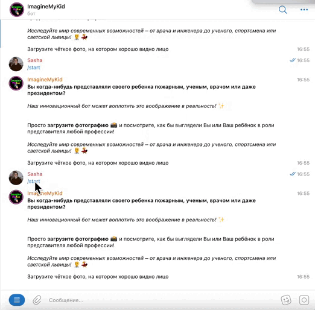

# Image Telegram Bot

The `Image Telegram Bot Implementation` project is a simple asynchronous bot for generating photos using requests to SegmindAPI. The user sends a photo, selects a gender, profession, and the bot generates a photo.



## Technology stack


## Features

- Generation/swap photos using AI `Stable Diffusion XL 1.0` (img2img) and `Faceswap`(img2img).
- Watermark generation using the `pillow` library.
- Integration is carried out using `post requests` to `SegmindAPI`.
- Bot implements a check to see if the user is in the telegram channel.
- Bot implements a `payment system` via YUKASSA.
- The `aiogram 3.*` library is asynchronous, which speeds up the work of the bot.
- Interaction with the `PostgreSQL`'s database is carried out using `SQLAlchemy` ORM.

## Project Structure

```tree
.
├── LICENSE
├── README.md
└── src
    ├── core
    │   ├── config
    │   │   └── config.py
    │   ├── database
    │   │   ├── database.py
    │   │   ├── db_ai.json
    │   │   ├── models.py
    │   │   └── queries
    │   │       └── orm.py
    │   ├── handlers
    │   │   └── basic.py
    │   ├── keyboards
    │   │   └── kb.py
    │   └── menu
    │       └── set_meny_button.py
    ├── images
    │   └── icon.png
    ├── ai_model.py
    ├── .env.example
    ├── .env
    ├── main.py
    └── requirements.txt
```


## Contributing

Contributions are welcome to enhance `Image_Bot`. Feel free to fork the project, make your changes, and submit a pull request.

## License

This project is licensed under the MIT License - see the [LICENSE](LICENSE) file for more details.